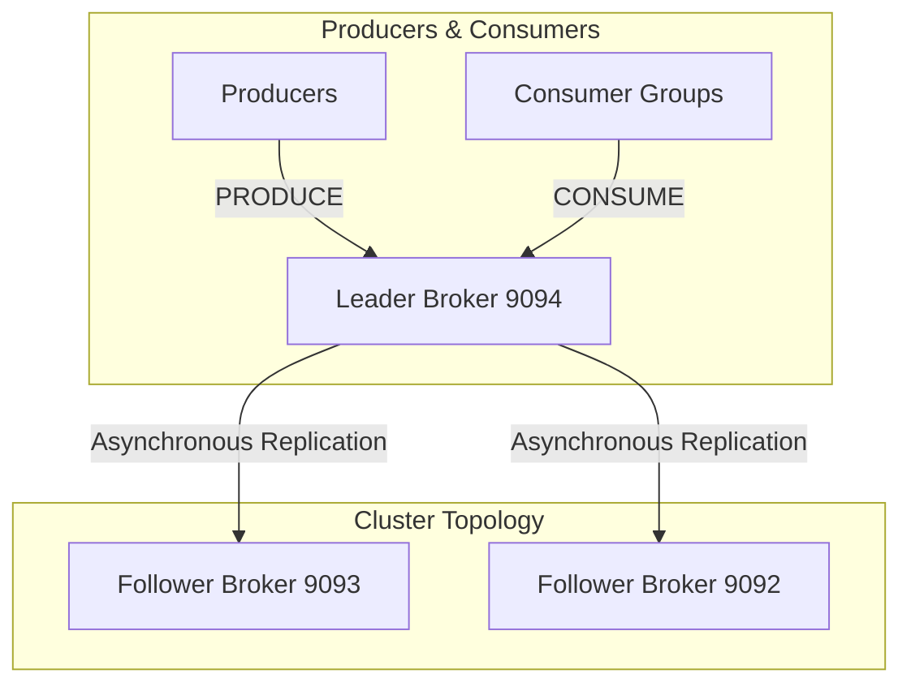
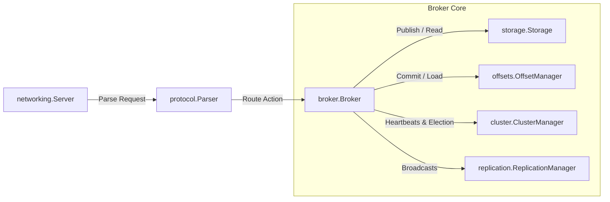
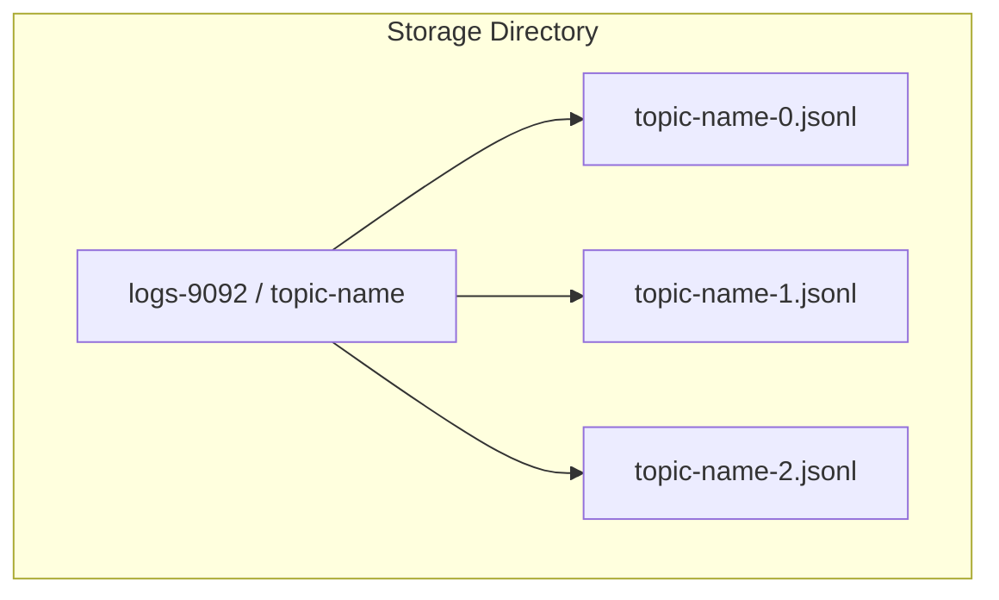
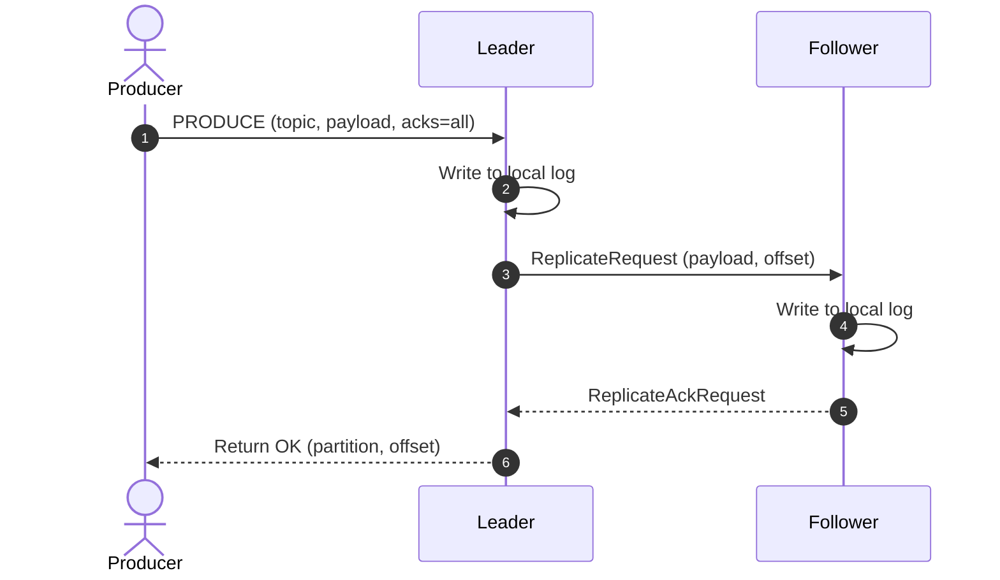
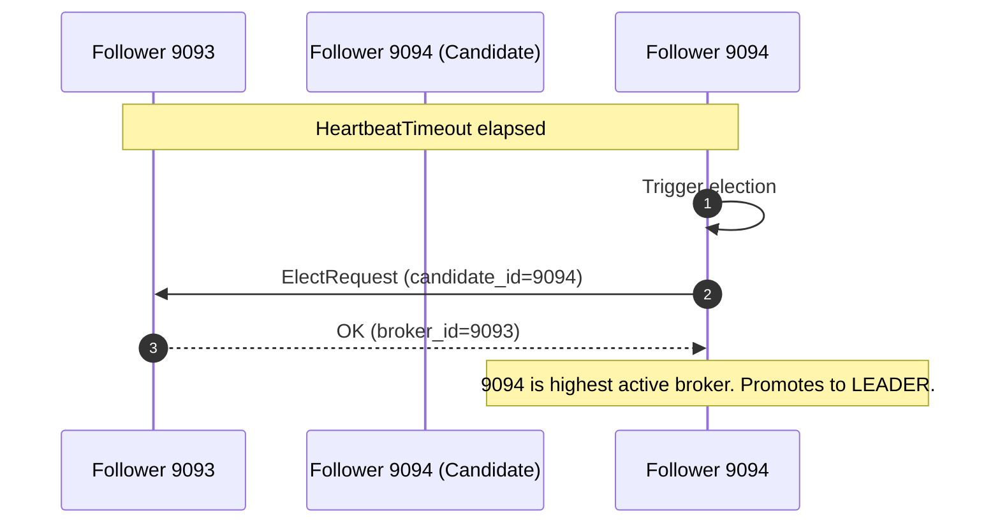
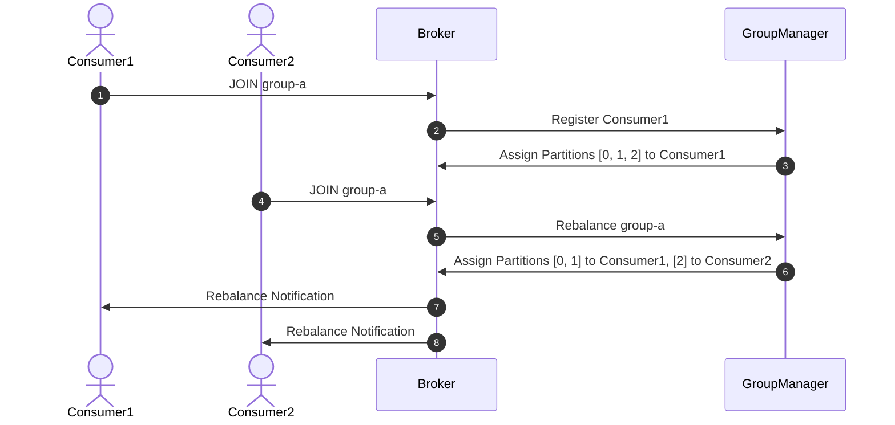

# CowpybaraMQ

A distributed log-based message broker inspired by Apache Kafka, built in Python to explore distributed systems, replication, partitions, consumer groups, and fault tolerance.

---

[](https://www.python.org/)
[](LICENSE)
[](https://github.com/aryanp160/cowpybaraMQ)
[](https://github.com/aryanp160/cowpybaraMQ/actions)
[](https://github.com/aryanp160/cowpybaraMQ/commits/main)

---

## Table of Contents
- [Project Overview](#project-overview)
- [Feature Matrix](#feature-matrix)
- [System Architecture](#system-architecture)
- [Sequence Diagrams](#sequence-diagrams)
- [Failure Scenarios](#failure-scenarios)
- [Benchmarks](#benchmarks)
- [Screenshots & Demo](#screenshots--demo)
- [Project Structure](#project-structure)
- [Configuration Reference](#configuration-reference)
- [Protocol Specification](#protocol-specification)
- [Design Decisions](#design-decisions)
- [Comparison Matrix](#comparison-matrix)
- [Roadmap](#roadmap)
- [Contributing](#contributing)
- [Testing Guide](#testing-guide)
- [License](#license)

---

## Project Overview

### Why CowpybaraMQ Exists
CowpybaraMQ was built as an educational tool to demystify the inner workings of modern distributed log-based event systems like Apache Kafka. It showcases how to handle concurrent connections over TCP, maintain strict ordering constraints across partitions, load balance dynamic consumer groups, and coordinate failover replication without relying on external heavy-weight frameworks.

### What Problems Message Brokers Solve
In microservice architectures, systems need to communicate reliably without direct, synchronous HTTP/gRPC coupling. Message brokers act as intermediate coordinators, enabling:
- **Asynchronous Communication**: Services publish events and proceed without blocking on consumer processing.
- **Backpressure Management**: Slow consumers can read messages at their own pace without exhausting system resources.
- **Fault Isolation**: If a consumer service goes down, messages are queued or persisted in the broker until it recovers.

### Queue Systems vs. Log-Based Brokers
Traditional queues (e.g., RabbitMQ) delete messages immediately after consumer acknowledgment, supporting transient queues. 

Log-based brokers (e.g., Apache Kafka, CowpybaraMQ) treat topics as ordered, append-only commit logs on disk. Messages persist regardless of consumption status, allowing multiple independent consumer groups to replay history from arbitrary offsets.

### CowpybaraMQ vs. Apache Kafka
While Kafka utilizes ZooKeeper/KRaft, complex JVM memory tuning, and custom page caches, CowpybaraMQ is designed for educational accessibility:
- **Simplicity**: Written in lightweight async Python.
- **Accessibility**: Zero external infrastructure dependencies (e.g. no JVM, no external database).
- **Core Concepts**: Implements partitions, thread-safe persistent offsets, leader election, and multi-node TCP replication.

---

## Feature Matrix

| Feature | Description | Status |
| :--- | :--- | :---: |
| **TCP Broker** | Lightweight asynchronous TCP socket server handling concurrent clients. | **Supported** |
| **Persistent Logs** | Append-only partition storage on disk using JSONL formatting. | **Supported** |
| **Topics & Partitions** | Topic segment partitioning with key-based CRC32 routing. | **Supported** |
| **Consumer Groups** | Dynamic partition load-balancing using Round-Robin rebalances. | **Supported** |
| **Committed Offsets** | Thread-safe offset tracking persisting to local storage files. | **Supported** |
| **Replication** | Asynchronous TCP log replication from Leaders to Followers. | **Supported** |
| **Leader Election** | Bully-style automatic election selecting active broker with highest ID. | **Supported** |
| **ACK Modes** | Customizable produce write safety (`acks=0`, `acks=1`, `acks=all`). | **Supported** |
| **Simulation Utility** | CLI suite to inject broker failures, disconnections, and recoveries. | **Supported** |

---

## System Architecture

### 1. Overall Cluster Topology
Shows the multi-broker network routing traffic from producers and coordinating replication.



### 2. Broker Components Internals
Visualizes the internal modules handling socket lines and disk writes.



### 3. Storage Layer Architecture
How partitioned JSONL logs map to segments on the local filesystem.



---

## Sequence Diagrams

### 1. Producer → Broker (ACKS=all)
Shows replication confirmation from followers before leader responds.



### 2. Heartbeat & Leader Election
Shows election trigger on heartbeat loss.



### 3. Consumer Group Join & Partition Rebalance
Dynamic assignment of partitions on consumer register.



---

## Failure Scenarios

### Leader Crashes
- **Problem**: The primary broker serving writes crashes.
- **Detection**: Followers miss periodic heartbeats exceeding `HEARTBEAT_TIMEOUT`.
- **Recovery**: Active followers broadcast `ElectRequest`. The active broker with the highest `broker_id` promotes itself to Leader.
- **Expected Behaviour**: Client producers receive connection errors, reconnect to the new leader, and resume publishing. Standalone and group consumers reconnect and resume fetching.

### Follower Crashes
- **Problem**: A replica broker crashes.
- **Detection**: The Leader detects socket disconnects and drops the follower writer from the replication pool.
- **Recovery**: Upon restart, the recovered follower registers via `RegisterFollowerRequest` sending its current partition offsets.
- **Expected Behaviour**: The leader streams missing historical logs to catch the follower up.

### Offset Corruption
- **Problem**: The offset tracking JSON file becomes corrupted.
- **Detection**: JSON parsing error on startup.
- **Recovery**: Corrupted offset entries are skipped, resetting the affected consumer group offset to `0` (or end of log).
- **Expected Behaviour**: Consumer group replays partition logs from the beginning.

---

## Benchmarks

Benchmarks executed locally using `cmd/benchmark.py` (500 payload iterations with 100-byte entries):

| Operation | Throughput (msgs/sec) | Latency p99 (ms) |
| :--- | :--- | :--- |
| **PRODUCE (acks=0)** | ~90,691.58 msgs/sec | 0.51 ms |
| **PRODUCE (acks=1)** | ~670.74 msgs/sec | 8.59 ms |
| **CONSUME** | ~26,114.19 msgs/sec | < 0.05 ms |

### Testing Methodology
Metrics were measured using a dynamic leader-follower subprocess network. Producers send a 100-byte structured JSON payload. Disk write latencies reflect local NVMe SSD append operations.

### Compression Benchmarks Expectations
When `gzip` compression is enabled:
- **Payloads below threshold**: No throughput or latency impact, as messages bypass the compression layer.
- **Large payloads (>512 bytes)**:
  - **Storage Reduction**: Log segment sizes on disk are reduced by up to **60-80%** for highly repetitive text payloads.
  - **Produce Latency**: Increases by **5-15%** due to CPU-bound gzip compression calculations.
  - **Consume Latency**: Minimal impact (p99 latency <0.1ms increase) as decompression is fast.

---

## Visualizing CowpybaraMQ in Action

### 1. Broker Cluster Status Monitor
Running `python cmd/cluster_admin.py show_cluster` returns a real-time layout of the cluster state:
```text
============================================================
                 COWPYBARAMQ CLUSTER STATUS
============================================================
Current Leader: 9094 (127.0.0.1:9094)
------------------------------------------------------------
Broker: 9094 @ 127.0.0.1:9094 | Status: ALIVE | Role: leader
  Disconnected (network partition): False
  Followers connected: ['127.0.0.1:9093', '127.0.0.1:9092']
  Follower Offsets: {'9093': 105, '9092': 105}
  Topics: ['orders']
    - Topic 'orders': 3 partitions
  Replication Latency: Avg 1.25ms (from 105 acks)
  Messages Replicated count: 105
  Connected Clients: 1
  Throughput: 1300 messages/sec
------------------------------------------------------------
Broker: 9093 @ 127.0.0.1:9093 | Status: ALIVE | Role: follower
  Disconnected (network partition): False
  Followers connected: []
  Follower Offsets: {}
  Topics: ['orders']
    - Topic 'orders': 3 partitions
  Replication Latency: Avg 0.00ms (from 0 acks)
  Messages Replicated count: 0
  Connected Clients: 0
  Throughput: 0 messages/sec
------------------------------------------------------------
```

### 2. Producer CLI Output
When producing messages with `python cmd/producer.py --topic orders --message '{"event": "checkout"}' --key "user_1"`:
```text
[PRODUCE] Sending to 127.0.0.1:9094 (Leader)
  Payload: {"event": "checkout"}
  Routing Key: user_1 -> Hashed to Partition: 0
  Response: {"status": "ok", "partition": 0, "offset": 42}
```

### 3. Consumer CLI Output
Subscribed via `python cmd/consumer.py --topic orders --group-id order-processors --consumer-id c1`:
```text
[CONSUME] Registered to group: order-processors (c1)
[CONSUME] Assigned partitions: [0, 1]
[CONSUME] Partition 0 | Offset 42: {"event": "checkout"}
[CONSUME] Committing offset 43... Success.
```

### 4. Broker Failover and Leader Election Logs
```text
2026-07-07 18:30:10,210 - internal.cluster - WARNING - [ELECTION EVENT] Heartbeat timeout (2.03s). Triggering leader election.
2026-07-07 18:30:10,211 - internal.cluster - WARNING - [ELECTION EVENT] Broker 9093 initiating leader election.
2026-07-07 18:30:10,345 - internal.cluster - WARNING - [ELECTION EVENT] Active brokers discovered: [9093, 9092]. Highest ID: 9093.
2026-07-07 18:30:10,346 - internal.cluster - WARNING - [ELECTION EVENT] Broker 9093 promoting itself to LEADER.
```

---

## Recording a Demonstration

Follow this flow to record a terminal GIF/video (using tools like `asciinema` or `vhs`):

1. **Start Cluster**: Launch three terminal tabs with `python cmd/broker.py --port 9092 --broker-id 9092`, `python cmd/broker.py --port 9093 --broker-id 9093`, and `python cmd/broker.py --port 9094 --broker-id 9094`.
2. **Show Status**: In a fourth tab, run `python cmd/cluster_admin.py show_cluster` to demonstrate the active leader (9094) and followers.
3. **Produce Messages**: Publish a batch of messages:
   ```bash
   python cmd/producer.py --topic payments --message "pay_event_1" --key "user_A"
   ```
4. **Consume Messages**: Start a consumer subscription and verify the payload is received:
   ```bash
   python cmd/consumer.py --topic payments --group-id payment-consumers --consumer-id pc1
   ```
5. **Inject Leader Crash**: Execute:
   ```bash
   python cmd/cluster_admin.py kill_leader --leader-port 9094
   ```
6. **Verify Bully Election**: Show the broker logs indicating broker 9093 took over as leader.
7. **Produce on New Leader**: Send messages to port 9093 and verify followers replicate them.
8. **Run Benchmark**: Display the high-throughput performance metrics:
   ```bash
   python cmd/benchmark.py --count 1000
   ```

---

## Project Structure

```text
cowpybaraMQ/
├── cmd/
│   ├── broker.py          # Broker server entry point
│   ├── producer.py        # Produce command utility
│   ├── consumer.py        # Consumer subscription tool
│   ├── status.py          # Diagnostics tool
│   ├── benchmark.py       # Cluster benchmarking engine
│   └── cluster_admin.py   # Observing and Simulating cluster failover states
├── internal/
│   ├── broker.py          # Coordinates message flow, loops and metrics
│   ├── cluster.py         # ClusterManager, heartbeat tracking, elections
│   ├── config.py          # Environment settings loader
│   ├── groups.py          # Consumer group partition assignment coordinator
│   ├── networking.py      # TCP server socket management loops
│   ├── offsets.py         # Persistent commit offset file managers
│   ├── partition.py       # JSONL partition file readers and writers
│   ├── protocol.py        # Network line parser and protocol dataclasses
│   ├── replication.py     # Asymmetric peer-to-peer sync engine
│   └── storage.py         # Topics directory layout mapper
└── tests/                 # Integration, stress, and unit testing scripts
```

---

## Configuration Reference

The broker reads the following settings from environment variables or CLI arguments:

| Argument | Env Variable | Default | Description |
| :--- | :--- | :--- | :--- |
| `--port` | `COWPYBARA_PORT` | `9092` | TCP Server listening port |
| `--role` | `COWPYBARA_ROLE` | `leader` | Node role (`leader` or `follower`) |
| `--leader-host`| `COWPYBARA_LEADER_HOST`| `127.0.0.1` | Leader host address to connect to |
| `--leader-port`| `COWPYBARA_LEADER_PORT`| `9092` | Leader port to connect to |
| `--broker-id` | `COWPYBARA_BROKER_ID` | `PORT` | Unique cluster identification number |
| `--cluster-members`| `COWPYBARA_CLUSTER_MEMBERS`| `127.0.0.1:9092...` | Cluster topology registry |
| `--compression-type` | `COWPYBARA_COMPRESSION_TYPE` | `none` | Message compression codec (`none`, `gzip`) |
| `--compression-threshold` | `COWPYBARA_COMPRESSION_THRESHOLD` | `512` | Minimum payload size in bytes to trigger compression |

---

## Message Compression Architecture

CowpybaraMQ implements a transparent pluggable message compression layer. Payloads published to topics can be compressed prior to persistence on disk to reduce disk I/O usage and network replication volume.

### How it Works:
1. **Threshold Check**: When a message is produced, its serialized JSON representation size is checked against the configured threshold (`--compression-threshold`).
2. **Pluggable Compression**: If the size exceeds the threshold, the payload is compressed using the active codec (e.g. `gzip`) and encoded in Base64.
3. **Structured Metadata**: The compressed payload is stored in the partition logs wrapped with metadata:
   ```json
   {
     "offset": 42,
     "message": {
       "_compressed_payload": "H4sICD5+...",
       "_compression": "gzip"
     }
   }
   ```
4. **Transparent Decompression**: When a consumer fetches the message, the partition storage reader automatically identifies the `_compressed_payload` field, decompresses the data, and returns the original JSON structure.

---

## Protocol Specification

All socket packets are **newline-delimited JSON strings** over raw TCP.

### 1. PRODUCE Request
```json
{"action": "produce", "topic": "orders", "payload": {"val": 42}, "key": "user_1", "acks": "all"}
```
### 2. PRODUCE Response
```json
{"status": "ok", "partition": 0, "offset": 12}
```
### 3. Heartbeat Frame
```json
{"action": "heartbeat", "sender_id": "9092", "role": "leader"}
```

---

## Design Decisions

### Append-Only JSONL Logs
- **Decision**: Persist partition logs in JSON Lines format (`.jsonl`).
- **Trade-off**: Simple to read, debug, and parse sequentially. However, it consumes more disk space compared to raw binary logs (like Kafka Index files).

### Asynchronous Heartbeats
- **Decision**: Exchange heartbeats asynchronously outside the storage write path.
- **Trade-off**: Keeps latency of producing messages low, but can result in transient split-brain if network isolation occurs before election checks complete.

---

## Comparison Matrix

| Feature | CowpybaraMQ | Apache Kafka | RabbitMQ | NATS |
| :--- | :---: | :---: | :---: | :---: |
| **Log-Based** | Yes | Yes | No (Queue) | No (Queue/JetStream)|
| **Ordering** | Partition | Partition | Queue | Stream |
| **Broker Replication**| Yes | Yes | Yes | Yes |
| **Dependencies** | None | KRaft/ZooKeeper| Erlang VM | Go Runtime |

---

## Roadmap

- [ ] **Consensus Protocol**: Migrate simplified Bully election to full Raft Consensus.
- [ ] **Zero-Copy Performance**: Integrate binary memory buffers to bypass JSON parser loops.
- [ ] **SSL/TLS**: Implement encrypted secure TCP transmission.
- [ ] **Tiered Storage**: Automatically compress and archive cold logs to S3.

---

## Contributing

We welcome contributions! Please follow these standards:
- **Code Style**: Ensure python files conform to `black` formatting standards.
- **Linter**: Verify no errors are reported by `flake8 .`.
- **Tests**: All tests in `tests/` must pass cleanly.

---

## Testing Guide

Cowpybara contains a comprehensive testing suite under `tests/`:
- **`test_broker.py`**: Validates basic JSON parser logic and socket connections.
- **`test_cluster_integration.py`**: Verifies dynamic failovers, crash simulation, disconnects, and ACK modes (`acks=0/1/all`).
- **`test_replication.py`**: Checks replication logs duplication guard.

Run the test suite locally:
```bash
pytest
```

---

## License

This project is licensed under the terms of the MIT License. See [LICENSE](LICENSE) for details.
