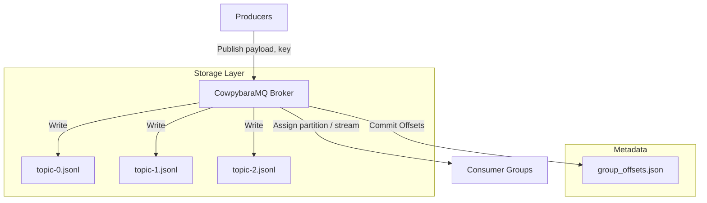
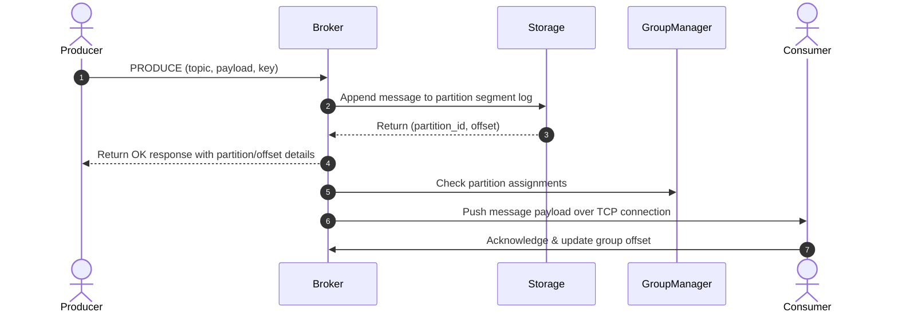
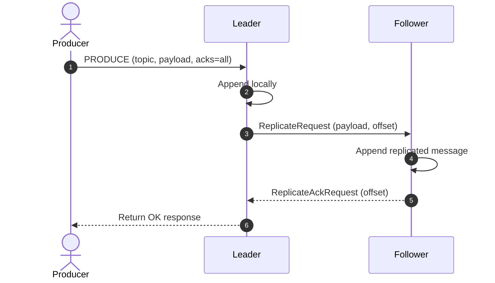
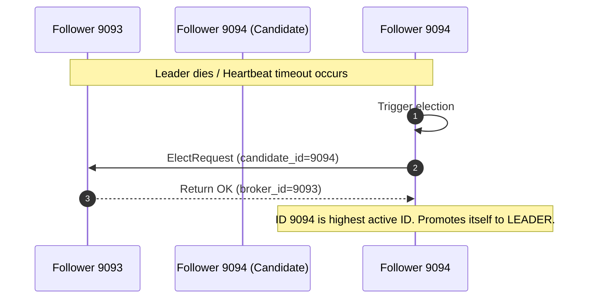
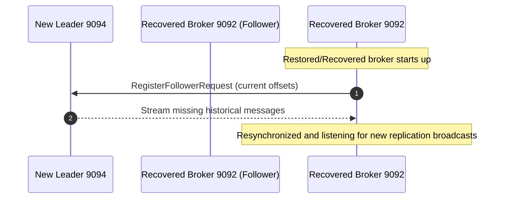

# CowpybaraMQ


A distributed log-based message broker inspired by Apache Kafka, built from scratch in Python.

---

## Features

- **Producer/Consumer Model**: Non-blocking asynchronous message publishing and subscription over raw TCP sockets.
- **Consumer Groups**: Scalable consumption with round-robin partition distribution among group members.
- **Persistent Offsets**: Thread-safe group commit offset storage persisting to disk (`storage/group_offsets.json`).
- **Topic Partitioning**: Support for hashing message keys to determine target partition segments (`orders-0.jsonl`, etc.) preserving partition-level ordering.
- **Automatic Rebalancing**: Dynamic workload reallocation notifying active consumers immediately when members join or leave a group.
- **Monitoring Utilities**: Real-time stats engine and throughput metrics utility (`status`) tracking message rate (msgs/sec) and partition ownership.
- **Persistent Logs**: Structured JSON Lines (JSONL) append-only logging recovering state smoothly after broker restarts.

---

## Architecture

CowpybaraMQ follows a multi-producer, multi-consumer model inspired by Apache Kafka. It is structured into the following layers:

1. **TCP Server & Protocol Layer**: Listens on port `9092` using `asyncio` TCP sockets. Decodes newline-delimited JSON commands using a lightweight protocol parser.
2. **Central Broker**: Coordinates the delivery pipeline, dynamically subscribing consumers to partitions and dispatching active publish events.
3. **Storage Layer**: Divides topics into physical partition segments (`<topic>-<partition>.jsonl`) using key-based hash routing.
4. **Consumer Groups**: Rebalances partitions round-robin among group members upon client join/leave events.

### System Topology



### Messaging Sequence



---

## Folder Structure

```text
cowpybaraMQ/
├── cmd/
│   ├── broker.py          # Asynchronous TCP Broker Server
│   ├── producer.py        # Producer CLI Utility
│   ├── consumer.py        # Consumer CLI Utility
│   └── status.py          # Status Diagnostics Monitor
├── docs/                  # In-depth architectural/protocol documentation
│   ├── architecture.md
│   ├── protocol.md
│   ├── storage.md
│   ├── consumer-groups.md
│   └── partitions.md
├── internal/              # Core modules (protocol parser, partition managers)
├── logs/                  # Storage directories for partitioned JSONL segments
├── tests/                 # Comprehensive Pytest suite (integration, unit, stress)
├── pyproject.toml         # Python dev tooling setup (Black)
├── requirements-dev.txt   # Development dependencies
└── requirements.txt       # Core dependencies
```

---

## Running Locally

### 1. Start the Broker
Run the asynchronous TCP broker:
```bash
python cmd/broker.py
```

### 2. Launch Status Diagnostics
Verify broker state:
```bash
python cmd/status.py
```

### 3. Consume from Topic Group
Run a consumer group member to consume messages:
```bash
python cmd/consumer.py --topic orders --group-id analytics-group --consumer-id c-1
```

### 4. Publish Partitioned Messages
Publish a message using key hashing routing:
```bash
python cmd/producer.py --topic orders --message "Order payload details" --key "user_abc"
```

---

## Benchmarks

Measurements conducted locally under 1000 messages load:

| Operation | Throughput | Avg Latency |
| :--- | :--- | :--- |
| **PRODUCE** | ~1,331 msgs/sec | 0.75 ms |
| **CONSUME** | ~21,318 msgs/sec | < 0.05 ms |

---

## Roadmap

- [x] **V1 Base Broker**: Basic TCP server and single-broker sequential logging.
- [x] **V2 Partitions & Rebalancing**: Dynamic partition segment logs, group rebalance triggers, and status diagnostics.
- [x] **V2 Partitions & Rebalancing**: Dynamic partition segment logs, group rebalance triggers, and status diagnostics.
- [x] **V3 Replication**: Peer-to-peer broker cluster setups, heartbeat-based leader election, configurable producer ACKs, replication logs, and failover simulation.

---

## Replication and Failover Diagrams

### 1. Normal Replication (acks=all)



### 2. Leader Failure & Heartbeat Timeout



### 3. Recovery & Resynchronization



---

## Contributing

We welcome contributions! Please open issues or submit pull requests. Ensure all code satisfies formatting (`black .`) and passes all linting tests (`flake8 .`).
