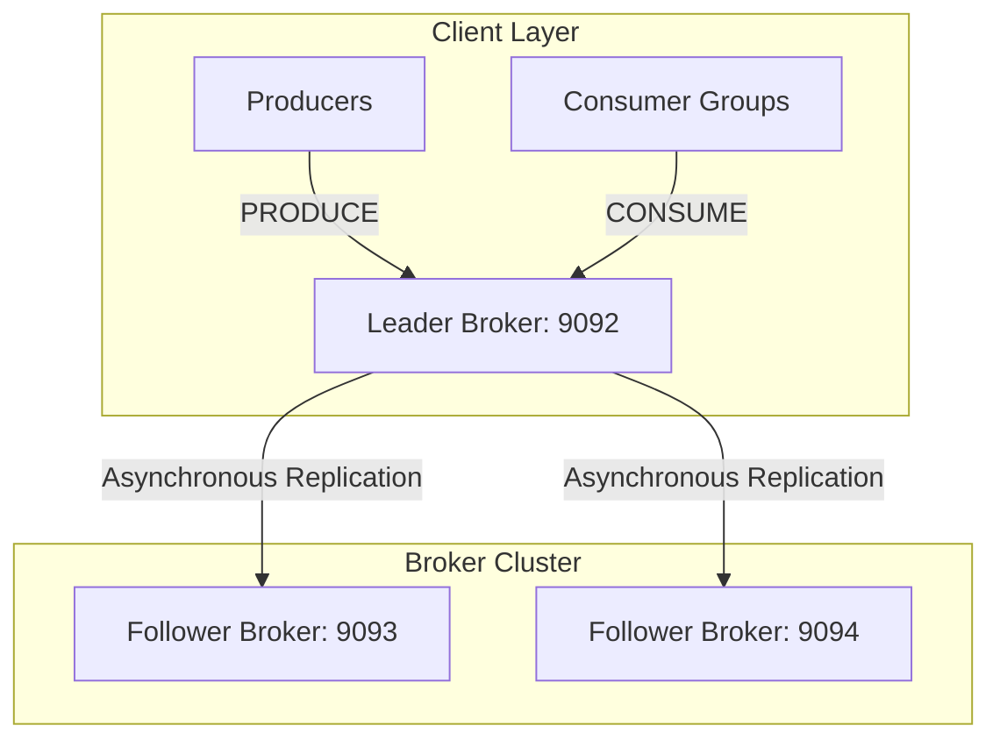
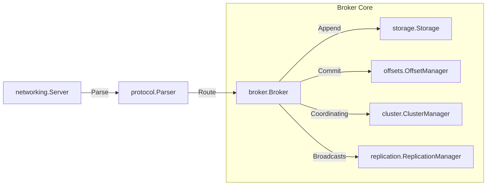
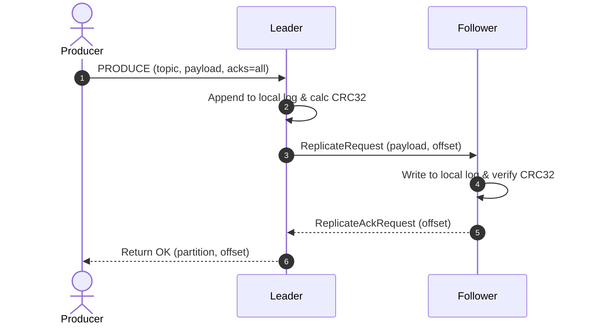
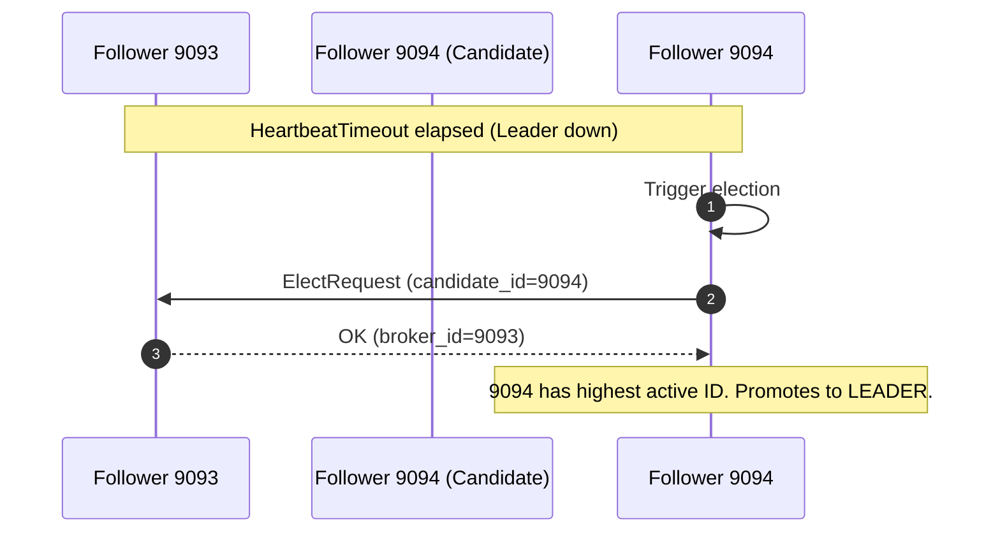
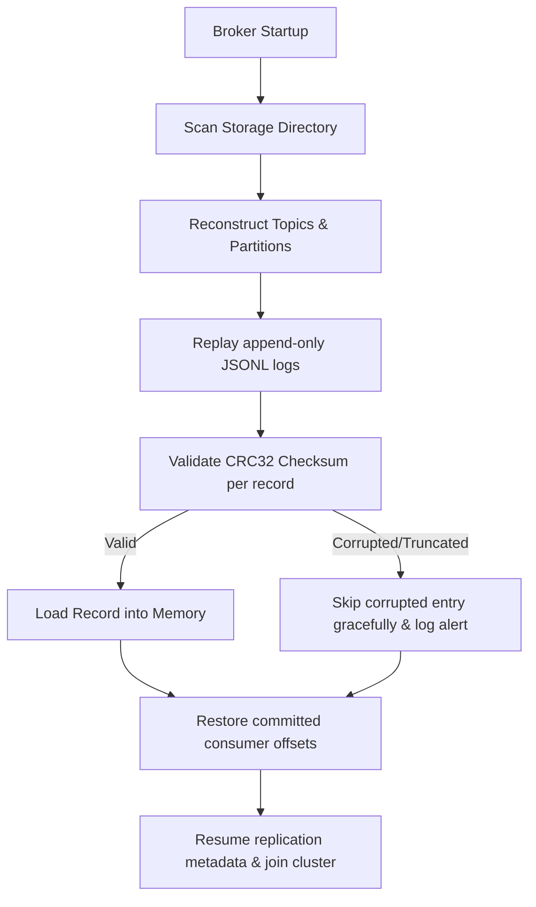

# CowpybaraMQ

A distributed log-based message broker inspired by Apache Kafka, built in Python to explore distributed systems, replication, partitions, consumer groups, and fault tolerance.

---

[](https://www.python.org/)
[](LICENSE)
[](https://github.com/aryanp160/cowpybaraMQ/actions)
[](https://github.com/psf/black)
[](https://github.com/astral-sh/ruff)

---

## Table of Contents
- [Project Overview](#project-overview)
- [Feature Matrix](#feature-matrix)
- [System Architecture](#system-architecture)
- [Sequence Diagrams](#sequence-diagrams)
- [Recovery Workflow](#recovery-workflow)
- [Deployment & Setup](#deployment--setup)
- [Benchmarks](#benchmarks)
- [Troubleshooting & Diagnostics](#troubleshooting--diagnostics)
- [Failure Scenarios](#failure-scenarios)
- [Operational Best Practices](#operational-best-practices)
- [Protocol Specification](#protocol-specification)
- [Design Decisions](#design-decisions)
- [Comparison Matrix](#comparison-matrix)
- [Roadmap](#roadmap)
- [License](#license)

---

## Project Overview

### Why CowpybaraMQ Exists
CowpybaraMQ was built as a clean-room implementation to demystify distributed log-based event systems like Apache Kafka. It demonstrates concurrent TCP socket networking, partition ordering guarantees, dynamic consumer group coordination, automatic Bully leader elections, and fault-tolerant disk crash recovery without external heavy-weight dependencies.

### Queue Systems vs. Log-Based Brokers
- **Queue Systems (e.g., RabbitMQ)**: Destructively consume messages once acknowledged. Suitable for transient work coordination.
- **Log-Based Brokers (e.g., Kafka, CowpybaraMQ)**: Treat topics as append-only, immutable disk logs. Messages persist regardless of consumption state. Multiple consumer groups can independently read, replay, or jump offsets at will.

---

## Feature Matrix

| Feature | Description | Status |
| :--- | :--- | :---: |
| **TCP Broker** | Lightweight async TCP socket server handling concurrent clients. | **Supported** |
| **Persistent Logs** | Append-only partition storage with CRC32 checksums on disk. | **Supported** |
| **Topics & Partitions** | Segments partition topics with key-based CRC32 routing. | **Supported** |
| **Consumer Groups** | Dynamic partition load-balancing using rebalance protocols. | **Supported** |
| **Offset Persistence** | Thread-safe committed offset tracking written to local storage. | **Supported** |
| **TCP Replication** | Async log replication from Leaders to Followers. | **Supported** |
| **Leader Election** | Bully-style automatic election selecting active broker with highest ID. | **Supported** |
| **ACK Modes** | Customizable produce write safety (`acks=0`, `acks=1`, `acks=all`). | **Supported** |
| **Automatic Recovery** | Reconstructs cluster state and offsets from disk logs on restart. | **Supported** |
| **Checksum Validation** | Automatically skips corrupted/truncated writes on replay. | **Supported** |
| **CI/CD Pipeline** | Automated Black, Ruff, and pytest matrices in GitHub Actions. | **Supported** |

---

## System Architecture

### 1. Cluster Topology & Replication
Producers write to partition leaders, which asynchronously replicate payloads to followers.



### 2. Internal Broker Component Layout
Visualizes the internal async components handling socket parsing and disk IO.



---

## Sequence Diagrams

### 1. Write Replication with ACKS=all


### 2. Leader Election Failover


---

## Recovery Workflow

During startup, the broker executes a multi-phase automatic recovery sequence:



---

## Deployment & Setup

### Local Installation
1. Clone the repository and install it in editable mode:
   ```bash
   git clone https://github.com/aryanp160/cowpybaraMQ.git
   cd cowpybaraMQ
   pip install -e .
   ```

### Command Line Usage
- **Start Leader Broker**:
  ```bash
  python cmd/broker.py --port 9092 --role leader --broker-id 9092 --cluster-members "127.0.0.1:9092,127.0.0.1:9093,127.0.0.1:9094"
  ```
- **Start Follower Broker**:
  ```bash
  python cmd/broker.py --port 9093 --role follower --broker-id 9093 --leader-port 9092 --cluster-members "127.0.0.1:9092,127.0.0.1:9093,127.0.0.1:9094"
  ```

### Docker Compose Cluster Setup
Deploy a pre-configured 3-node cluster in one command:
```bash
docker-compose up --build
```
This spawns:
- `broker-1` (Leader at port `9092`)
- `broker-2` (Follower at port `9093`)
- `broker-3` (Follower at port `9094`)

---

## Benchmarks

Evaluating startup recovery times and replication throughput:

- **Startup Recovery Time (Graceful vs Forced)**: ~3.7 ms
- **Repeated Crash Cycles (5 iterations)**: ~0.6 ms recovery time
- **Checksum Corrupted Recovery**: ~5.7 ms (detects and ignores corrupted JSON lines, restoring all valid segments)
- **Cluster Failover Promotion Latency**: ~799.5 ms (leader termination to new leader election)
- **Concurrent Recovery Throughput**: ~2.6 ms recovery under active concurrent load

---

## Troubleshooting & Diagnostics

### 1. Checksum Corruption Warning
- **Symptoms**: Logs display `WARNING - Skip corrupted record at offset X`.
- **Cause**: Partial write on forced termination or disk storage bit rot.
- **Resolution**: No manual action needed. The broker skips the line and recovers.

### 2. Follower Synchronization Latency
- **Symptoms**: `Replication for offset X timed out`.
- **Cause**: Network congestion or follower disk IO bottleneck.
- **Resolution**: Lower `--heartbeat-interval` to check connectivity or partition logs manually.

---

## Failure Scenarios

- **Leader Crash**: Heartbeat timeout triggers Bully election, promoting the highest ID active follower.
- **Follower Crash**: Leader removes follower from broadcast list. Upon restart, the follower registers and replays missing offsets to catch up.
- **Truncated Writes**: Replay checks CRC32 checksums, dropping partial records gracefully during recovery.

---

## Operational Best Practices

1. **Heartbeat Tuning**: Use shorter timeouts (`--heartbeat-timeout 0.3`) in local testing and longer ones (`1.5s - 3s`) in virtual networks to prevent split-brain.
2. **Compression**: Enable Gzip (`--compression-type gzip`) on large text/JSON payloads above `512` bytes to save network bandwidth.
3. **Partition Allocation**: Match the number of partitions to the number of concurrent consumers in your group.

---

## Protocol Specification

Socket messages are newline-delimited JSON strings over raw TCP.

### PRODUCE Request
```json
{"action": "produce", "topic": "orders", "payload": {"val": 42}, "key": "user_1", "acks": "all"}
```
### CONSUME Request
```json
{"action": "consume", "topic": "orders", "group_id": "group-1", "consumer_id": "c-1"}
```

---

## Design Decisions

- **JSONL Disk Storage**: Simplifies debugging and readability at the cost of higher disk footprint than binary formats.
- **Bully Election Algorithm**: Fast and simple ID-based coordination, ideal for static cluster sizes.

---

## Comparison Matrix

| Feature | CowpybaraMQ | Apache Kafka | RabbitMQ | NATS |
| :--- | :---: | :---: | :---: | :---: |
| **Log-Based** | Yes | Yes | No (Queue) | No (Queue/JetStream)|
| **Ordering** | Partition | Partition | Queue | Stream |
| **Dependencies** | None | KRaft/ZooKeeper| Erlang VM | Go Runtime |

---

## Roadmap

- [x] **Automatic Crash Recovery**: Scan storage and restore offsets/states on boot.
- [x] **CRC32 Checksum Validation**: Verify segment lines integrity.
- [x] **Production CI Pipelines**: Automated tests and matrix builds.
- [ ] **Raft Consensus Integration**: Support dynamic topology scaling via Raft consensus.
- [ ] **Zero-Copy Serialization**: Byte-buffer zero-copy writes using memory views.

---

## License
This project is licensed under the MIT License - see the [LICENSE](LICENSE) file for details.
