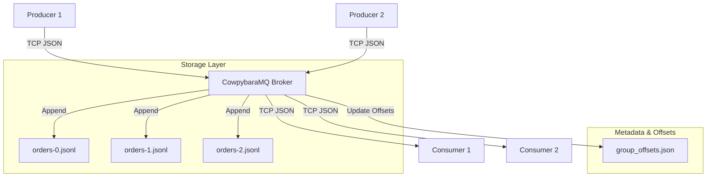

# Architecture Documentation

CowpybaraMQ is a distributed log-based message broker written from scratch in Python. It follows a multi-producer, multi-consumer model inspired by Apache Kafka.

## Components Overview

### 1. TCP Server & Protocol Layer
The broker listens on a customizable port (default `9092`) using `asyncio.start_server`. It handles concurrent TCP client connections. All communication uses newline-delimited JSON strings.

### 2. Central Broker Logic
The `Broker` class manages state, routing messages to storage partitions and streaming them to active subscribers.

### 3. Storage Layer
Topics are divided into physical partition log segments named `<topic>-<partition>.jsonl`. The storage layer manages deterministic routing of messages to partitions based on hashing keys.

### 4. Consumer Groups & Partition Assigner
`GroupManager` tracks active consumer registrations per group and distributes topic partitions round-robin among connected members.
