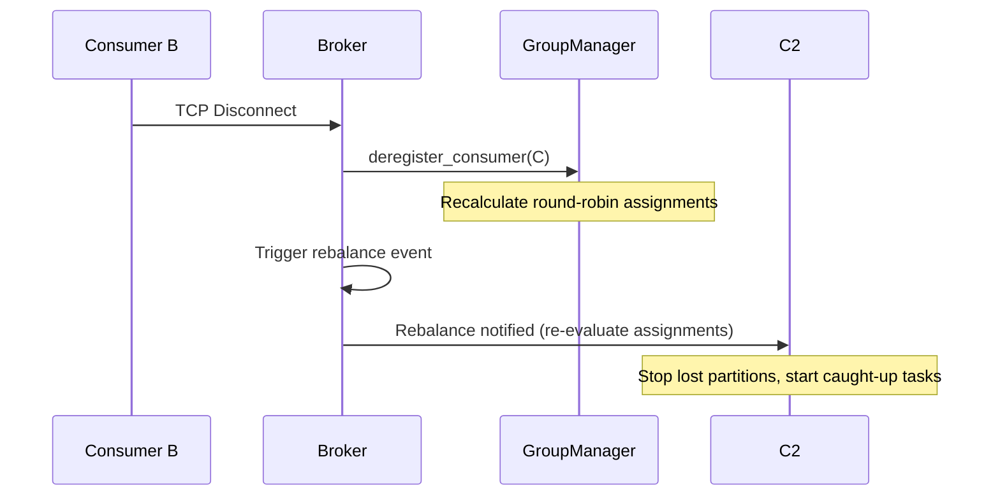

# Consumer Groups Documentation

Consumer groups enable scaling of consumption by automatically sharing partition workloads.

## Workload Sharing

Within a group (e.g. `analytics-group`):
- Connect 3 consumers to a topic with 3 partitions.
- Each consumer is assigned exactly 1 partition.
- If a consumer leaves or a new consumer joins, a rebalance event occurs.

## Rebalancing Flow



## Offset Tracking

Consumer group offsets are stored independently on disk:
`storage/group_offsets.json`
```json
{
  "analytics-group": {
    "orders": {
      "0": 12,
      "1": 46
    }
  }
}
```
Offsets are updated automatically upon successful message delivery.
